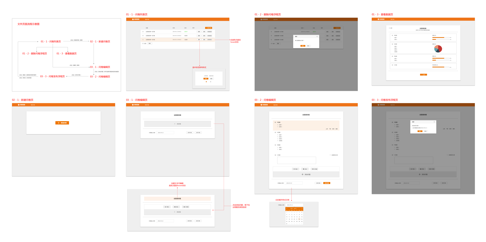
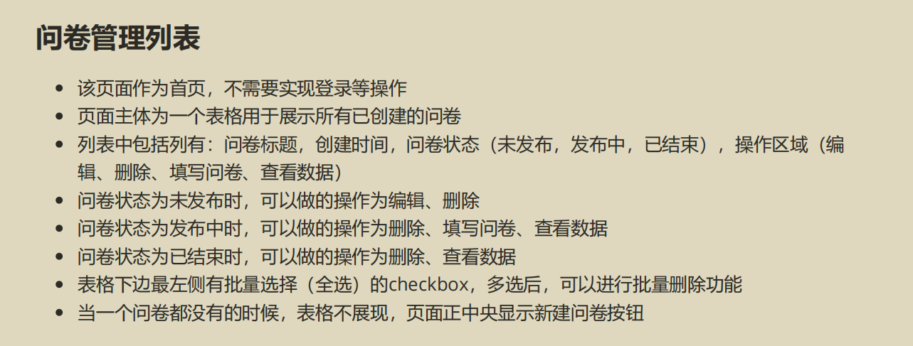
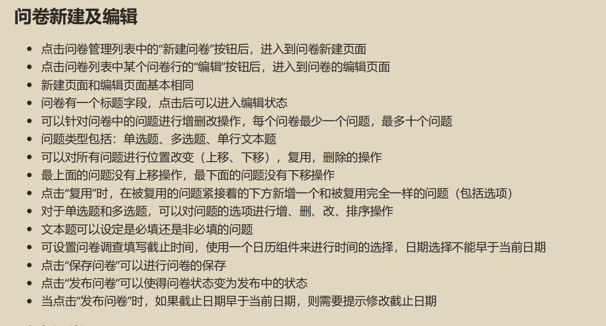
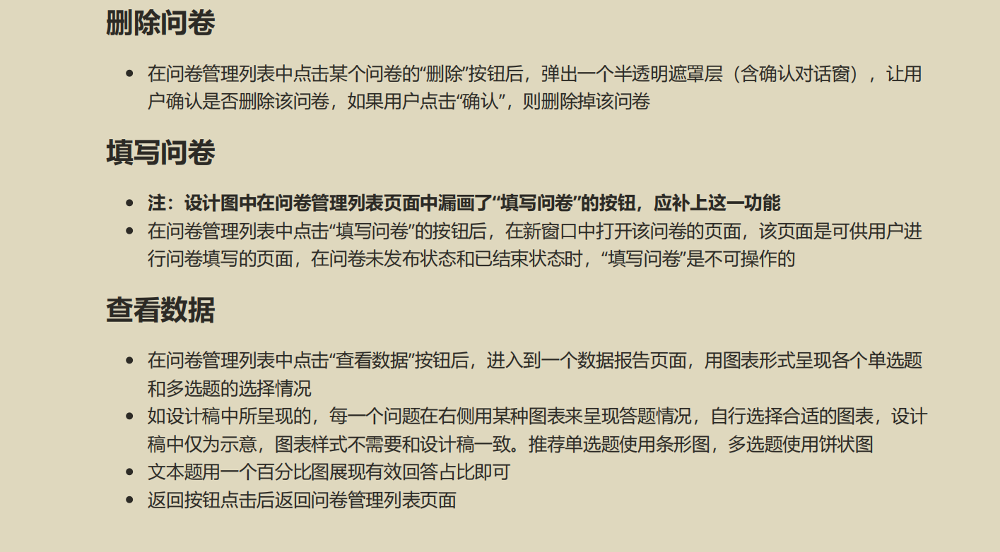

# 调查问卷网站

#### 介绍
一个 vue 的纯前端项目

#### 软件架构

Vue3

Node 版本 v18.12.1

Npm 版本 v8.19.2

#### 测试
##### 在线测试
[https://qs.vite66.cn](https://qs.vite66.cn)

##### 本地测试
克隆/下载

#### 设计图


#### 实现功能






#### 使用说明

##### Project setup
```
npm install
```

##### Compiles and hot-reloads for development
```
npm run serve
```

##### Compiles and minifies for production
```
npm run build
```

##### Lints and fixes files
```
npm run lint
```

##### Customize configuration
See [Configuration Reference](https://cli.vuejs.org/config/).

#### 参与贡献

1.  Fork 本仓库
2.  新建 Feat_xxx 分支
3.  提交代码
4.  新建 Pull Request

#### 相关

个人博客: [vite66.cn](https://vite66.cn)

邮箱：vite66@163.com

#### 特技

1.  使用 Readme\_XXX.md 来支持不同的语言，例如 Readme\_en.md, Readme\_zh.md
2.  Gitee 官方博客 [blog.gitee.com](https://blog.gitee.com)
3.  你可以 [https://gitee.com/explore](https://gitee.com/explore) 这个地址来了解 Gitee 上的优秀开源项目
4.  [GVP](https://gitee.com/gvp) 全称是 Gitee 最有价值开源项目，是综合评定出的优秀开源项目
5.  Gitee 官方提供的使用手册 [https://gitee.com/help](https://gitee.com/help)
6.  Gitee 封面人物是一档用来展示 Gitee 会员风采的栏目 [https://gitee.com/gitee-stars/](https://gitee.com/gitee-stars/)
